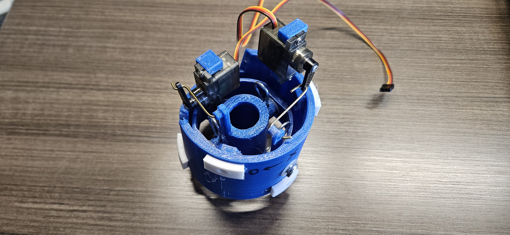
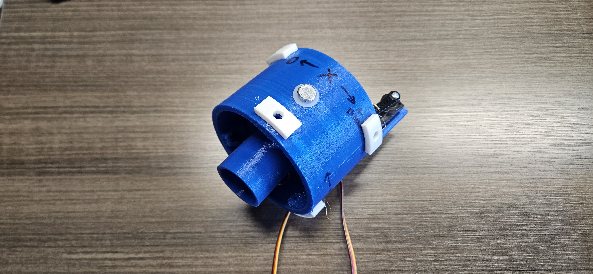
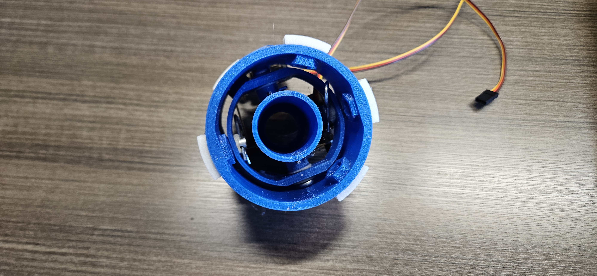
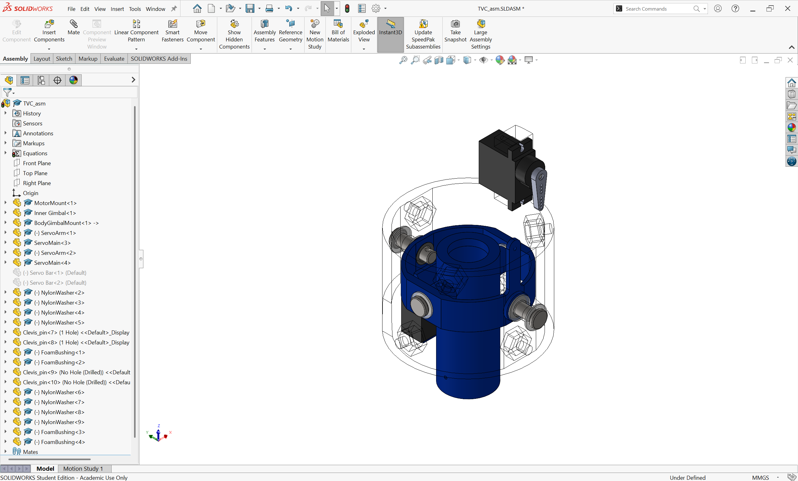
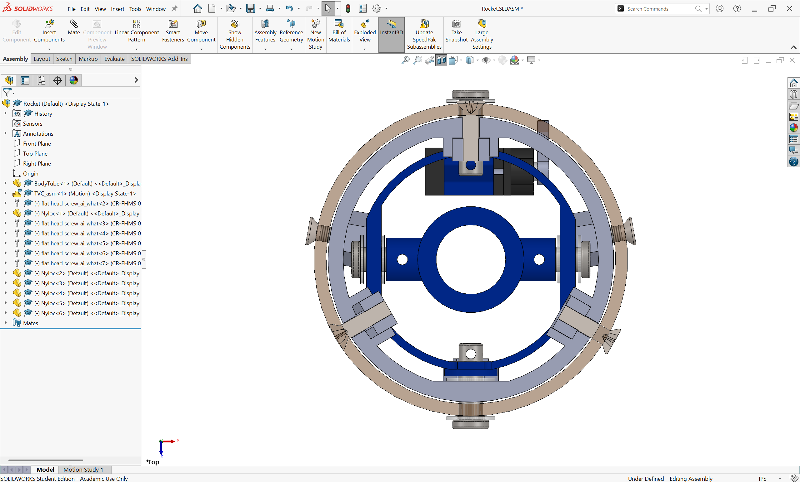
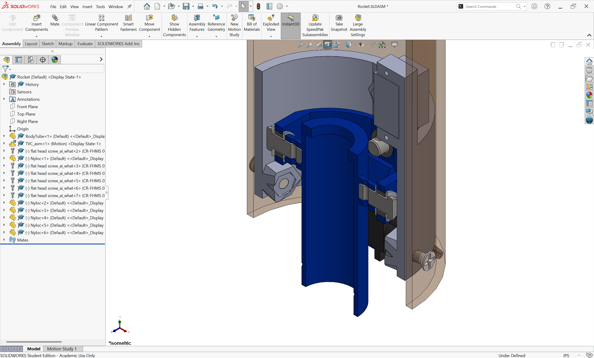
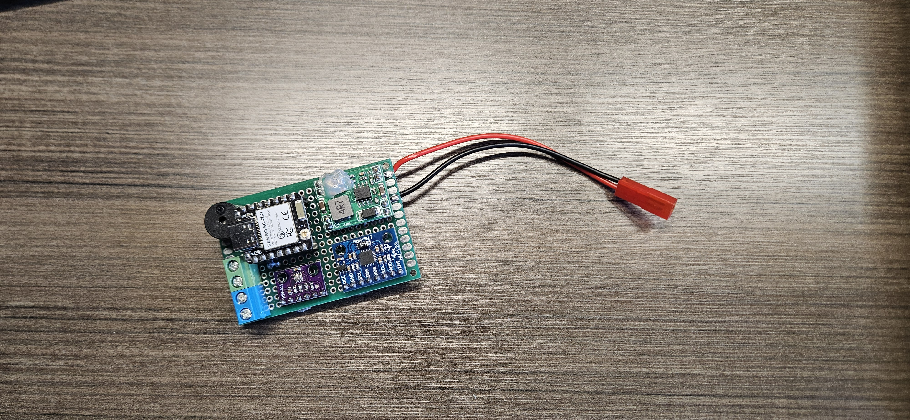
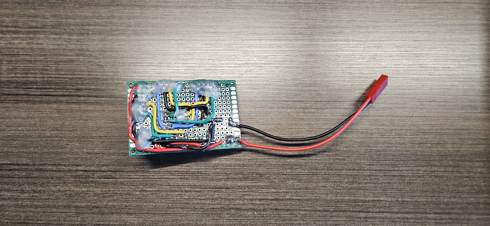

# Two-Axis Thrust Vector Control Model Rocket

A model rocket featuring a two-axis thrust-vector-control (TVC) system, custom flight computer, embedded control software, and a Python flight simulation for controller development and pre-flight testing.

<!--  -->
<div align="center">
  <br>
  <i>Two-axis gimbal actuation test. Both axes are commanded with a sinusoidal function.</i>
</div>

---

## Project Overview

This project is an experimental model rocket designed around an active two-axis thrust-vector-control system. Rather than using aerodynamic control surfaces, the vehicle controls its attitude by mechanically redirecting motor thrust.

The system consists of:

* A lightweight two-axis TVC gimbal
* XIAO ESP32C6 flight computer running MicroPython
* MPU6050 IMU and BMP280 barometer
* Servo-based gimbal actuation
* Python flight-dynamics and control simulation
* SolidWorks mechanical design and 3D-printed prototypes

The project is being developed incrementally, with mechanical design, simulation, electronics integration, and ground testing preceding flight testing.

---

## Project Documentation
This project is documented using a design notebook format, recording engineering decisions, prototypes, testing, failures, and design integration in chronologically organized notebooks. 

| Subsystem | Documentation |
| --------- | ------------- |
| Mechanical | [Mechanical Design Notebook](docs/mechanical/README.md)
| Electronics | [Electronics Design Notebook](docs/electronics/README.md)
| Simulation | [Simulation Design Notebook](docs/simulation/README.md)
| Testing | [Testing & Validation](docs/testing/README.md)

A note on testing: most testing is documented in the related design log, so the testing subsection will be lightly used and possibly removed later.

---

## Current Status

### Completed

* [x] Two-axis TVC gimbal mechanical design
* [x] SolidWorks parts and assembly
* [x] PETG gimbal assembly
* [x] XIAO ESP32C6 flight computer integration
* [x] MPU6050 IMU integration
* [x] BMP280 barometer integration
* [x] Servo actuation and gimbal bench testing
* [x] Initial Python flight simulation
* [x] PID control implementation in simulation

### In Progress

* [ ] Final rocket body design
* [ ] Flight simulation
* [ ] Sensor fusion
* [ ] Electronics documentation
* [ ] Controller tuning and hardware validation
* [ ] Integrated ground testing

### Planned

* [ ] Full-system ground test
* [ ] First controlled flight
* [ ] Flight data collection
* [ ] Post-flight data analysis

---

## Technical Specifications

| Parameter           | Current Specification                   |
| ------------------- | --------------------------------------- |
| Target liftoff mass | ~250 g                                  |
| Motor               | D12-5 target; E12-6 under consideration |
| Maximum TVC angle   | Approximately ±30°                      |
| Flight computer     | Seeed Studio XIAO ESP32C6               |
| Firmware            | MicroPython                             |
| IMU                 | MPU6050                                 |
| Barometer           | BMP280                                  |
| Gimbal actuation    | MG90S Servo motors                      |
| Gimbal axes         | 2                                       |

Specifications are subject to change as the vehicle design and simulation are refined.

---

## System Architecture

The system is divided into three primary components:
<div align="center">
  <br>
</div>

---

## Flight Simulation
[Subsystem Page](docs/simulation/)

Flight Simulations planned to be compiled in MATLAB with Simulink. These will simulate the rocket's PID controls as well as physical status in flight, allowing PID constants to be tuned and verified before first flight.

---

## Embedded Hardware

The flight computer uses a XIAO ESP32C6 running MicroPython.

### Sensors

* **MPU6050** — inertial measurement
* **BMP280** — barometric altitude measurement

### Control

Servo actuators are commanded using PWM outputs from the ESP32C6. The embedded control software is intended to use sensor measurements to determine vehicle attitude and command the TVC servos accordingly.

Sensor-fusion and closed-loop hardware control are currently under development, and will follow this closed-loop flow:

<div align="center">
  <br>
</div>

### Data Logging

Telemetry is currently logged to the flight computer's internal storage. The target logging rate is approximately 100 Hz, although the final rate will be determined through testing.

---

## Electronics

The flight computer is assembled on perfboard around a XIAO ESP32C6.
The design prioritizes simplicity and modularity during the prototype phase, allowing sensors and actuators to be replaced or repositioned without redesigning a PCB.


Additional documentation available in [Electronics Documentation](docs/electronics/)

---

## Repository Structure

```text
TVC/
├── docs/
│   ├── electronics/
│   ├── mechanical/
│   └── simulation/
├── CAD/
│   ├── Parts/
│   └── Assemblies/
├── Electronics/
├── Embedded/
├── Images/
├── Simulation/
└── notes.md
```

| Directory      | Contents                                            |
| -------------- | --------------------------------------------------- |
| `CAD/`         | SolidWorks parts, assemblies, and mechanical design |
| `docs/`        | Subsystem-specific documentation                    |
| `Electronics/` | Electronics schematics and hardware documentation   |
| `Embedded/`    | MicroPython flight-computer software                |
| `Images/`      | CAD renders, diagrams, and project photographs      |
| `Simulation/`  | Python flight simulation and control software       |
| `notes.md`     | Development notes and design history                |

---

## Development History

This project is being developed iteratively, with mechanical prototypes and simulation informing subsequent hardware revisions.

Major design iterations and test results will be documented here as development continues.

---

## Gallery

### TVC Assembly







*Full TVC assembly with the outer gimbal mount shown transparently.*

### Cutaway Views



*Gimbal mount cutaway.*



*Isometric cutaway showing internal components and pivot hardware.*

### Hardware



---

## Project Status

This is an active development project. Mechanical design, electronics integration, simulation, and control development are ongoing, and the vehicle has not yet completed controlled flight testing.


**Project To-Do**
*CAD/physical design:*
- [ ] Flight computer sled
  - [ ] Determine accessible mounting strategy for flight computer mounting hardware
- [ ] Finalize nose cone design
- [ ] Finalize body tube dimensions and mass properties
- [ ] Bulkhead
  - [ ] Determine suitable material for avionics bulkhead
  - [ ] Determine accessible mounting strategy for bulkhead
  - [ ] Determine motor ejection charge venting strategy


*Electronics:*
- [ ] MOSFET testing for ejection charge
- [ ] Ejection charge perfboard
- [ ] Documentation
  - [ ] Write about overlooking need for ejection charge


*Simulation:*
- [ ] OpenRocket finalize model
  - [ ] Figure out how to simulate rocket with artificial stability to bypass fin requirements
  - [ ] Run OpenRocket simulations to determine maximum altitude
- [ ] MATLAB physical simulation + control tuning


*Testing:*
- [ ] Thrust simulation 
  - [ ] CAD gimbal mount
  - [ ] CAD motor mount adapter for drone motor
  - [ ] Determine if rotary encoders for gimbal mount would be useful
- [ ] Ejection charge Nichrome testing
  - [ ] Ensure rapid heating
  - [ ] Check battery and electronics health
- [ ] Gimbal true angle min/maxes.