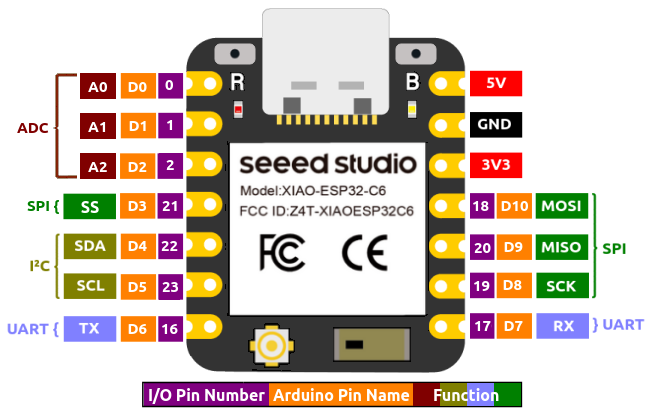

[← Back to project README](../../README.md)
# Electronics

## Design Requirements
The flight computer needs to:
- Read inertial measurements
- Measure barometric altitude
- Control two TVC servos
- Log flight data
- Fit within the available rocket body
- Be lightweight and serviceable
- Log data for post-flight review

---

## Entry 01 - Initial Design
Test sensors and construct a breadboard-based prototype of flight computer to verify all components and wiring architecture. Determine list of components to be included on final design.

### Design
The hardware present on the flight computer was primarily chosen due to previous possession of all sensors and controllers. These included:
- MPU 6050 IMU
- BMI 160 IMU
- BMP280 Barometer
- ESP32 XIAOC6 Microcontroller
- Arduino Nano Microcontroller

A pack of perfboard bases contained 40x60mm boards and 50x70mm boards. For size footprint, smaller was better for this project, so the 40x60mm board was targeted. 

Deciding on hardware was relatively simple: 
- The ESP32 has a much smaller footprint (21x17.5mm) versus the Nano (45x18mm), making it more suitable for the small size footprint of the targeted board.
- BMI 160 is a more modern sensor with less noise and more accurate readings than the MPU 6050.
The BMP280 was the sensor I had on-hand for altitude measurements.

The ESP32 will communicate over I2C to the IMU and altimeter, allowing both chips to only require 4 pins total on the ESP32. The ESP32 only has 10 data out pins.


The wiring diagram is as follows:
.jpg)

The ESP32 has a data line to both servos, which are then connected to the battery for power. The entire circuit including the battery shares a common ground. 

The battery for this build was chosen due to it's light weight and small profile. Large LiPos are too heavy and have excess capacity than needed for this build. For flying the flight computer without servos, a smaller battery could be substituted in for a smaller footprint. Since the chosen battery is 7.4V, a buck converter is needed to drop this to 5V for the ESP32 to input.

The initial buck converter chosen is a LM2596 DC to DC buck converter with a 3.0-40V to 1.5-35V adjustable range. However, these modules are large and bulky, so a more modern MP1584EN 4.5V-28V input to 0.8V-20V output adjustable converter was chosen. 

LM2596: 43.2 x 21.2mm
MP1584EN: 22.3 x 17mm

The converter has a potentiometer present to adjust the output voltage. This was set using a multimeter to confirm an output voltage of 5V.

A buzzer is also included in the design to allow for status communication when the rocket is assembled and ready to launch.

## Entry 02 - Perfboard Assembly
After all components were assembled and tested on a breadboard, they could be assembled on a perfboard. This uses holes to mount through hole components, so breakout boards and other large components can easily be soldered. 22 AWG single core wire was used to route connections between the components. The gauge was chosen to be stiff and not easily tangle or fall out of place after soldering. Single core wire is more likely to make one solid connection when soldered vs. stranded wire where a loose strand could make a faulty connection and short the board out. 


## Entry 03 - Software
The ESP32 runs MicroPython as firmware and runs one main code file. Python was chosen due to my proficiency in the language, and that this project is not one focused on learning programming concepts. Using PID control from robotics, a PID class was brought in to simplify development and reuse existing code. 

Existing libraries are used to communicate over I2C to the sensors & servos, and a pin is defined for the buzzer. These libraries allow the board to communicate with the sensors with an easy-to-use API. 

```py
class Pins: # Create pin mappings for easier reference based on physical printings on ESP32
    D0, D1, D2 = 0, 1, 2
    D3, D4, D5 = 21, 22, 23
    D6, D7 = 16, 17
    D8, D9, D10 = 19, 20, 18

# Setup I2C using builtin MicroPython module
SDA = Pin(Pins.D2)
SCL = Pin(Pins.D5)
i2c = SoftI2C(sda=SDA, scl=SCL, freq=100000)

# Sensors
# BMI180: 
  # https://github.com/DanielBustillos/bmi160-micropython-driver/tree/main
  # Authored by Daniel Bustillos
# BMP280: 
  # https://github.com/dafvid/micropython-bmp280
  # Authored by David Stenwall

imu = BMI180(i2c)
bmp = BMP280(i2c, use_case=BMP280_PRES_OS_16)

print(f"devices set up! i2c scan: {i2c.scan()}")

# Servos and maximum degrees
x_servo = Servo(Pins.D7)
x_servo_max = 100
y_servo = Servo(Pins.D9)
y_servo_max = 130
buzzer = Pin(Pins.D0, Pin.OUT)
```

The entry point for the code uses a master `FlightController` class, which exposes a `run()`function for the main code (`boot.py`) to run when the board is powered up. MicroPython runs boot.py on every power up, so any code in there will run immediately. For launches, setup and run code will be placed here.


Software to-do:
- [ ] Implement state machine to interpret ready, ascent, coast, apogee, and descent.