[← Back to project README](../../README.md)
# Mechanical Design

Mechanical components were designed in SolidWorks with an emphasis on minimizing mass while maintaining sufficient stiffness and range of motion for the TVC mechanism.

The gimbal components form two perpendicular rotational axes, allowing the motor thrust vector to be redirected in both pitch and yaw.

**Current Development Status:** V1 gimbal assembled and ready for airframe integration.

--- 

# Design Log

## Entry 01 - Research & Prototyping
### Goal
Research existing solutions for inspiration and to develop an understanding of gimbal mechanism.

### Research
Thrust Vector Control (TVC) is a solution employed by nearly all 'real' rockets. Rather than using fins to stabilize a rocket's flight, the thrust itself can be gimbaled to exert a torque, allowing active control to keep the rocket stable.

TVC is not limited to rocketry. It can also be found on aircraft and drones. In rocketry it is especially helpful because it allows us to control the orientation of a craft without relying on fins. Fins keep a rocket stable but rely on high dynamic pressure. A simple computation for dynamic pressure (q) is $q = \frac{1}{2} \rho v^{2}$, where $\rho$ is the fluid density of the air and $v$ is the velocity of the rocket. For large rockets with low thrust to weight ratios, this velocity is very low, leading to a proportional decrease in dynamic pressure. 
*[NASA](https://www.grc.nasa.gov/www/BGH/dynpress.html), [Richard Nakka](https://www.nakka-rocketry.net/RD_fin.htm)*

The goal for this rocket is to use TVC to actively stabilize the rocket, without passive stability mechanisms like fins. To do so, a gimbal needs to be constructed. The first step was to research existing solutions to this problem.

TVC has been done on the model scale before, and designs exist to construct your own. However, for this project the design will be custom. To get an idea for how to design this gimbal, I first explored existing solutions:
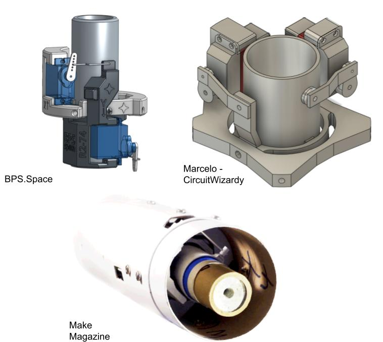

These solutions highlight a few major design points:
- The mounts typically use servo motors to orient the motor
- There are 3 main components: the outer mount which fixes to the airframe, an inner gimbal which provides one axis of freedom, and a motor mount which has the second axis of rotation. 
- Sometimes, the airframe is modified to make clearance for servo arms or moving components. 

### Understanding the Gimbal
The gimbal is the most important part of this design, so it is important to develop a strong intuition for what it is doing in the mechanism, and how the parts move in relation to each other. To do this, I developed a basic prototype in SolidWorks to mock up what the motion of the gimbal should look like. 

This mockup had some issues with constraints and motion, but it provided the baseline for understanding how the inner gimbal and motor mounts should move together. One thing that was important to understand was that one servo is fixed with the airframe, and the other moves with the inner gimbal mount. This allows the axis of rotation of the second servo to follow along as the first servo moves. 

When creating this mockup, a few things were noted:
- The static servo will need a connection higher up on the inner gimbal than where the gimbal pivots, to allow room for the servo mounting
- The largest challenge with this design will be clearance to allow as much range of motion as possible. 

## Entry 02 - Designing the Gimbal
### Goal
To create a more complete, manufacturable version of the gimbal mount that can be assembled for installation into the rocket.

### Design Requirements
Taking the preliminary mockup of motion into account, the design was developed oriented based on the axes of rotations. Working outwards in, the first part to be designed is the gimbal mount which is attached to the airframe.

Requirements:
- Provide two independent rotational axes
- Allow approximately ±15° of TVC movement
- Maintain the motor's position relative to the rocket centerline
- Provide mounting locations for two servos
- Avoid interference between the gimbal, servo arms, and airframe
- Be lightweight enough for the vehicle's mass budget
- Be manufacturable using desktop 3D printing

### Outer Gimbal Mount
The outermost component is the motor gimbal mount. This design follows the internal diameter of the airframe and has a mounting bracket for the servo motor. There is also a hole for the hardware to connect to the inner gimbal mount.
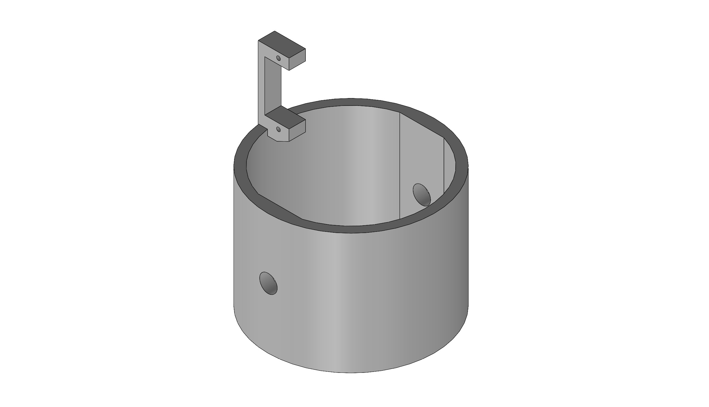

This initial geometry follows the mock up and establishes the overall interface between the airframe and the gimbal, providing a starting point to model and attach sub components.

Design for mounting hardware also needs to be considered. This will be done using bolts and nylon locking nuts for security. 
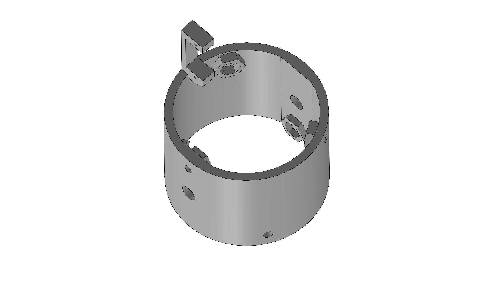
By including a hexagonal profile on the interior of the mount, the nylon nuts can be held in place with a small amount of glue and then be easily assembled with the physical slot holding the nut in place. This decision will allow for easier final assembly, where access within the gimbal is difficult.

### Inner Gimbal Mount
The inner gimbal provides the second rotational axis and carries the motor mount. Its geometry was driven primarily by three constraints:

1. Maintaining the required rotational range
2. Providing a mounting location for the second servo
3. Maintaining clearance from the outer mount throughout the range of motion

The inner gimbal was designed after the basic two-axis mechanism had been established in the preliminary SolidWorks mockup, as well as the design of the outer gimbal mount. This involved top-down part design which made it easy to define dimensions and verify clearance as geometry was added.

This part includes 4 axis holes for connection to the outer mount and the inner gimbal. It includes an arm to link to the outer mount servo, and another servo mount to hold the second servo.

### Motor Mount
The motor mount is the final layer of the gimbal that interfaces with the rocket motor and provides the final axis of rotation for the TVC mount. The mount needs to interface with standard Estes "Large" motors which have a 24mm OD. The initial motor-mount print used a 24.5 mm internal diameter, but the motor fit was too tight for practical assembly. The CAD dimension was increased to 25 mm for the subsequent revision. The resulting printed part measured approximately 24.75 mm internally and provided the desired fit.
The thrust is transmitted through the gimbal rotation hardware, so the motor mount includes a long sleeve to facilitate this. The sleeve around the hardware also is required because the presence of the motor makes it impossible to have hardware slot through the walls of the mount. 
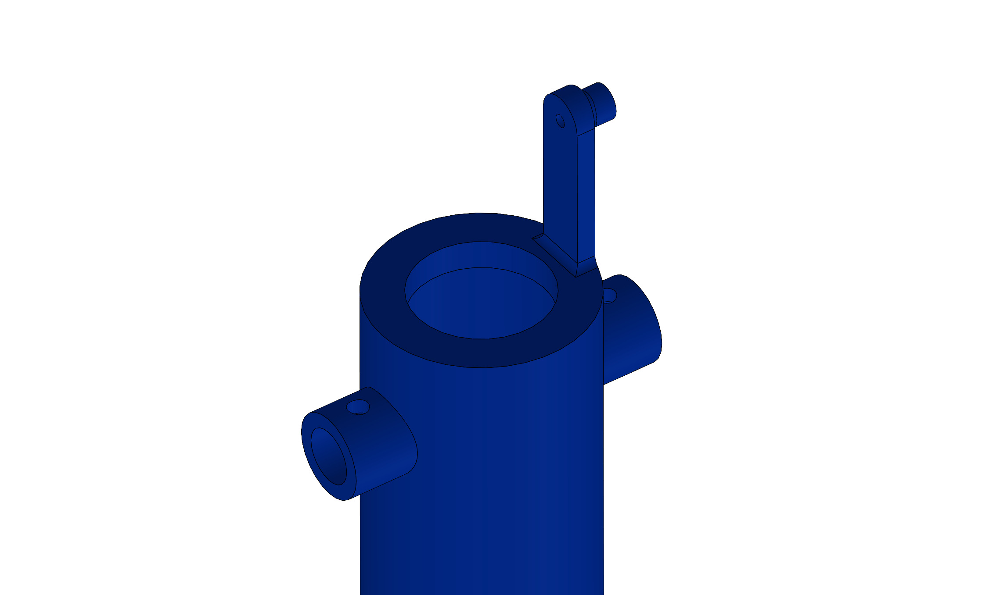
A connecting arm was also included similar to the inner gimbal to allow a connection between the motor mount and servo arm. 

### Assembly Plan
The assembly of the gimbal is difficult because it requires smooth motion between 3 interconnecting parts. Dowels and rods were considered, but a clevis and cotter pin were decided on. These allow rotation around an axis (due to the clevis pin) but lock translation across that axis (due to the cotter pin).

By combining pins and the holes provided within the design we can assemble the gimbal like so:
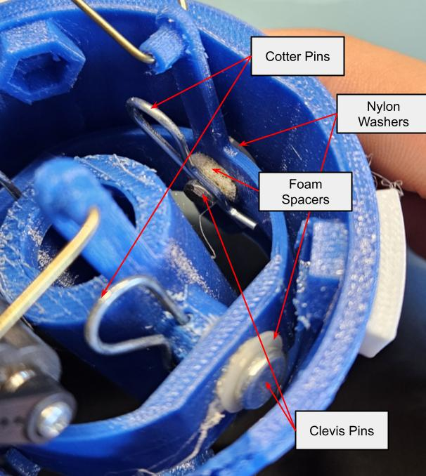
The foam spacers help the clevis pins remain centered within the axial holes on the gimbal parts, and the nylon washers help facilitate smooth rotation between components. The assembly hardware can be seen in these cut-outs of the CAD:

### Clearance & Range of Motion
By combining the gimbals into an assembly in SolidWorks, we can examining the range of motion of the gimbal. In initial inspection of this assembly, the clearance for the inner servo arm was very low due to the outer gimbal mount. To solve this, a slot was removed from the 3D printed component and a slot is planned to be cut in the airframe.

By moving each axis independently until a collision occurs, we can determine the approximate range of motion of the assembly:

X Axis:
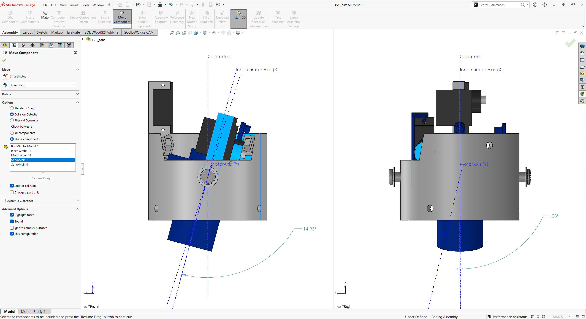
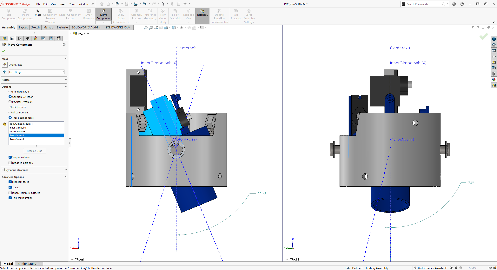
Y Axis:
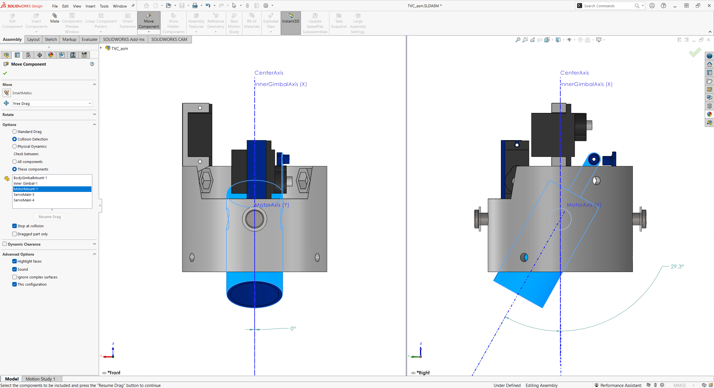
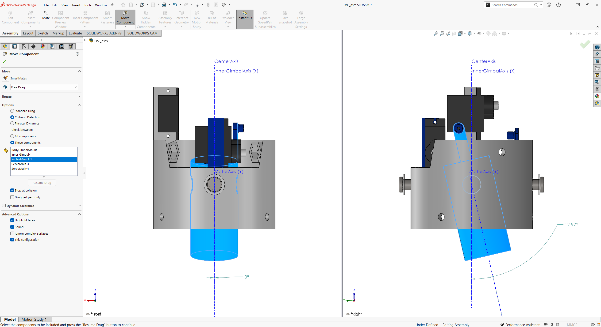

Based on these values, we can know the *approximate* range of motion for each gimbal axis:
| Axis |      Min      |       Max       |
| ---- | ------------- | --------------- |
| X    | $-15^{\circ}$ | $+22.5^{\circ}$ |
| Y    | $-30^{\circ}$ | $+13^{\circ}$   |

The limiting symmetric range is therefore approximately ±13°, although the mechanism has greater asymmetric travel in each axis. For the current design, ±15° is being treated as the nominal target range and will be validated through physical testing. With the physical assembly, modifications will be considered to increase the Y-axis limiting range by 2°.

### Materials
The initial prototype was printed and assembled in PLA Black. Due to concerns over brittleness, the current assembly is printed in PETG blue. PETG was selected for the current assembly because its greater ductility compared with PLA makes it less susceptible to brittle fracture during handling and mechanical loading.

### Final Assembly

<i> Final construction of V1 gimbal, including mounting hardware, servos, and servo linkage bars. </i>

### Initial Modifications
Shortly after initial construction, it was determined that there was significant limitation in the X - axis rotation. To fix this, the slot in the outer gimbal was expanded to make room for the inner gimbal servo arm.
Removed material highlighted in red.
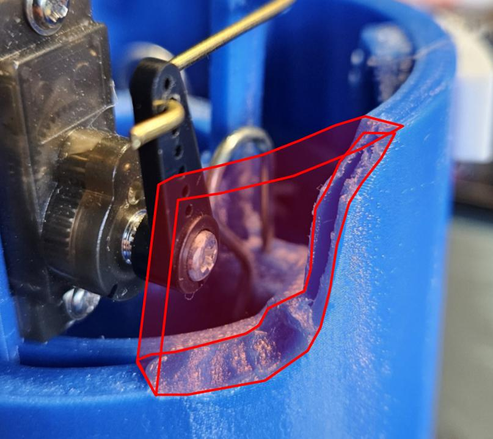
This adjustment has been updated in the CAD to reflect material removal and prevent the need from manually performing this operation in the future.

## Entry 03 - Clearance Inspection
To-do: Measure physical assembly gimbal angle limits and compare to CAD assembly theoretical limits.

## Entry 04 - Assembly V1 Evaluation
After the first assembly of the gimbal mount, observations were collected and the design was evaluated.

**Observations**
- The design has noticeable play in both rotation and translation, especially within the joint between the inner and outer gimbal components.
  - This interface likely comes from excess tolerance in the holes in the outer gimbal, allowing excess motion.
  - The motor mount is more rigid translationally but still has play rotationally. On both axes this most likely originates from imperfect linkages between servo and gimbal. 
- Upon application of upwards pressure to the motor mount (similar to the force that will be exerted by the motor) the inner gimbal translates vertically approximately 1.5mm. Gimbal motion due to servos *does not appear* to be limited by this force, but this will need to be verified with thrust simulation.
  - This allowed motion appears to flex portions of the inner gimbal outwards, most likely due to the material properties of PETG.

    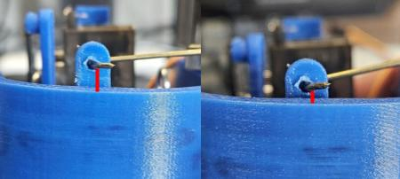    

- Clearance holes for airframe mounting bolts are too small, and hexagonal inserts for nylon locking nuts are too small.

  

**Potential Failure Modes**
- Component cracking
  - Due to the high force applied by the motor and inherent nature of plastic FDM printing, a major point of failure would be cracking or shattering of the gimbal mount during flight. This risk has been reduced by printing in PETG, but is not eliminated.
  - This could potentially be tested by determining the max force applied by the motor and simulating that force on the gimbal and inspecting for cracks or fractures.
- Excessive gimbal deflection
  - Excessive rotation of the gimbal due to the servo motors *could* occur, but is unlikely. Servo travel will be limited in software based on the measured mechanical range to prevent commands from driving the mechanism into known interference points.
- Pin movement
  - The play in the cotter pins introduces concern as another point of failure, but it is unlikely as the pins and clips themselves are steel. A failure of the plastic frame is much more likely.
- Servo linkage failure
  - This is a more likely point of failure for the design. The linkages between the servo arms and gimbal components could break or slip free during flight leaving the rocket without control over an axis of rotation, which would likely be catastrophic. In order to mitigate this, the ends of the linkages are bent around the connection points in a U shape to prevent disconnection.
- Mount deformation
  - Due to the heat generated by the rocket motor, the motor mount is subject to potential thermal deformation during flight, which could unpredictably degrade attitude control. While PETG has a processing melting range of 230–260°C, its structural limits are governed by its Heat Deflection Temperature (HDT) of 65–75°C (149–167°F), at which point the material softens under mechanical load. [[JLC3DP](https://jlc3dp.com/blog/petg-temperature-resistance)] Specific motor casing profiles during burns are unavailable, but thermal failure is expected to be low because the total exposure time (burn duration) is minimized, delaying localized hot spots. Post-flight inspections will monitor the mount for signs of softening, structural creep, or warping.

**Planned Revisions**
- Reduce extra clearance on clevis pin mounting holes in outer gimbal
- Move motor mount servo connection bar radially outwards to be more in line with the face of the servo to reduce play.
- If thermal deformation is found to be an issue, a cardboard or plastic liner can be used as a thermal barrier between the motor casing and mount to reduce deformation on subsequent flights.
- Increase hole and hexagonal insert diameter for airframe mounting hardware. These can be drilled out and press fit for this assembly, however.
- Add interior shoulder to inner gimbal, similar to outer shoulder on motor mount to reduce play at the clevis pin.

  <image src="planned_shoulder.jpg"> 
  <i>Notated planned shoulder addition: existing shoulder in green, location for additional shoulder in red.</i>

## Entry 05 - Airframe Design

### Initial Airframe

The initial plan for the airframe was to use the 3 in. ID cardboard tubing from my Tripoli Level 1 certification rocket. While this tubing is strong, its mass made it impractical for this project. The tubing weighed approximately **15.5 g/in.**, meaning that a roughly 2 ft. section would already exceed the maximum recommended lift weight of the selected motor before accounting for the motor, electronics, TVC assembly, and other hardware.

This prompted an investigation into lighter airframe materials.

### Fiberglass Investigation

One option considered was purchasing a pre-made fiberglass airframe. These were ultimately ruled out primarily due to cost and shipping. For example, a 30 in. section of 3 in. fiberglass tubing was priced at over $60. [[Wildman Rocketry](https://wildmanrocketry.com/collections/fiberglass-1/products/g12-3-0)]

As an alternative, I investigated manufacturing my own fiberglass body tube. This involved sourcing and preparing a mandrel, wrapping fiberglass around the mandrel, saturating the material with epoxy, and removing the cured tube from the mandrel.

The process proved to be more time-consuming than expected, particularly during removal of the cured tube from the mandrel. The resulting tube also required repair after removal and trimming. Despite these issues, the finished tube provided a useful comparison point and weighed approximately **11.58 g/in.**

### Lightweight Cardboard Alternative

During this process, I found a lightweight cardboard shipping tube with a **3.2 in. ID and 1.5 mm wall thickness**. At approximately **11 g/in.**, this tube was slightly lighter than the fiberglass tube while being significantly easier to cut, modify, and assemble.

The primary compatibility issue was the diameter of the existing TVC gimbal. The gimbal was designed around a 3 in. outer diameter, leaving a gap between the gimbal and the 3.2 in. ID airframe.

To resolve this, spacers were designed and 3D printed to attach to the outside of the gimbal and increase its effective diameter. The spacers are bonded to the gimbal rather than mechanically fastened because they do not carry the primary structural load. The existing screws retain the gimbal components, while the spacers primarily center the assembly within the airframe.

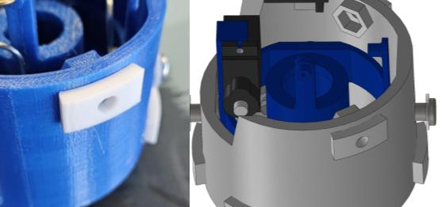

*3D-printed spacers used to adapt the 3 in. gimbal assembly to the larger-diameter airframe.*

### Current Design

The lightweight cardboard tube is currently the preferred airframe material because it provides a favorable combination of low mass, low cost, and ease of fabrication compared with the alternatives investigated.

The final airframe length will be determined after the remaining rocket geometry is finalized in CAD. This will allow the overall vehicle mass to be evaluated before selecting the final length and confirming that the completed vehicle remains within the motor's appropriate performance range.

### Design Comparison

| Airframe Option       | Approx. Mass | Advantages                               | Disadvantages                                      |
| --------------------- | -----------: | ---------------------------------------- | -------------------------------------------------- |
| 3 in. cardboard       |   15.5 g/in. | Strong, already available                | Too heavy for current mass budget                  |
| Homemade fiberglass   |  11.58 g/in. | Lightweight, rigid                       | Time-consuming to manufacture; difficult demolding |
| Lightweight cardboard |    ~11 g/in. | Lightweight, inexpensive, easy to modify | Larger diameter requires gimbal adaptation         |

The current design therefore prioritizes the lightweight cardboard tube, with the fiberglass tube serving as an investigated alternative rather than the final material.

---