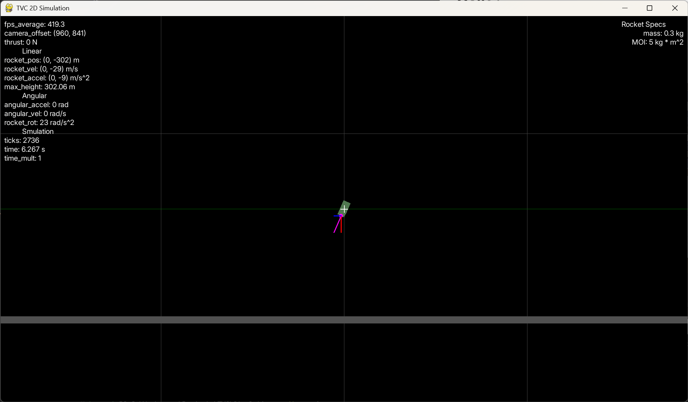

[← Back to project README](../../README.md)
# Simulation

---

## OLD SIM
The flight simulation is written in Python using `pygame-ce`. It models the rocket's translational and rotational behavior and provides a development environment for testing the control system before flight.

The simulation currently includes:

* Acceleration
* Velocity
* Position
* Thrust-vectoring torque
* PID control
* Estimated thrust-to-weight ratio
* Estimated apogee
* Simplified rocket-flight dynamics

The simulation is also compared against an independent OpenRocket model to identify discrepancies and improve the physical model.

*Current simulation interface and rocket-flight model.*

### Simulation Development

The simulation is still being refined. Current work includes:

* Standardizing units throughout the simulation
* Replacing simplified physical approximations with more representative models
* Modeling sensor noise and measurement behavior
* Improving the relationship between simulated sensor measurements and physical vehicle behavior
* Validating simulated results against OpenRocket and future flight-test data

The ultimate goal is to use the simulation to tune the control system before hardware testing and compare predicted behavior against measured flight data.
